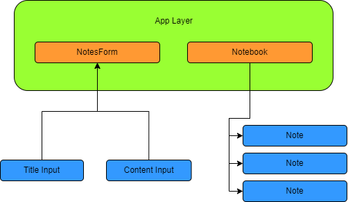

## Welcome to my Note App 🤩

This project was bootstrapped with [Create React App](https://github.com/facebook/create-react-app).

## 🦸‍♂️ Description

- Add notes with Title and Content
- Update notes

## 👨‍💻 Techstack

Here's a brief high-level overview of the tech stack the note-taking app uses:

- This project uses [Reactjs](https://reactjs.org/) JavaScript library for the frontend
- Styling is done using simple CSS

## 🛠 Packages / Plugins used

Packages used for implementing the following project are-

- [@heroicons/react](https://heroicons.com/)
  Icons used in the app are imported effortlessly from this package.

Tools used for development are-

- Chrome inspect for debugging HTML & CSS

## 🔎 Detailed Implementation

1. All the project level state management and state updation is written in <b>App.js</b>

   - notebook - Contains the array of notes
   - addNote() - Adds new note to the notebook array
   - updateNote() - Updates the note at the given index/id

2. App.js contains two major Containers/Components - <b>NotesForm</b> and <b>Notebook</b>
3. NotesForm is responsible with capturing the input from the user and pass it up to it's parent component
4. Notebook recieves the notebook state and maps the notes to render the individual <b>Note</b> component

<b style="margin-left:200px">☝ Component Structure</b>

### NotesForm

1. 👮 NotesForm has <b> build-in Validation</b> to check for empty title and content fields
2. ⚙ Two modes - <b>Add</b> & <b>Update</b>

### Notebook

1. 📒 Maps over the notebook state recieved from the App.js and renders Note component

### Note

1. Title
2. Content

## Available Scripts

In the project directory, you can run:

### `npm start`

Runs the app in the development mode.\
Open [http://localhost:3000](http://localhost:3000) to view it in your browser.

The page will reload when you make changes.\
You may also see any lint errors in the console.
